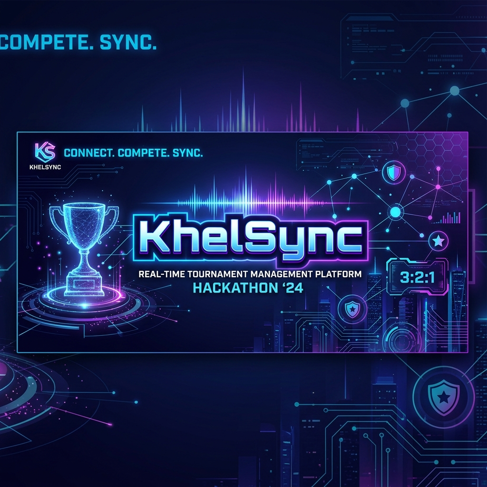
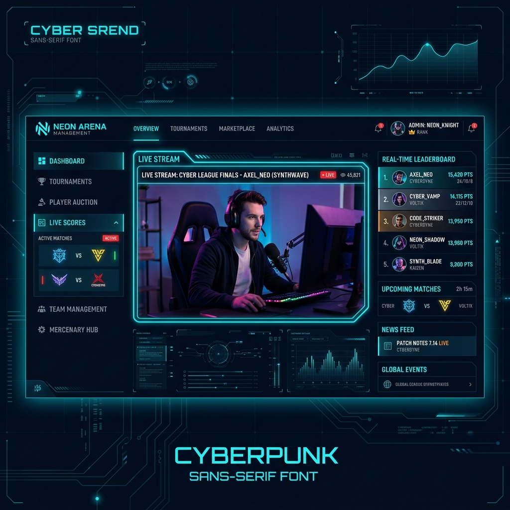
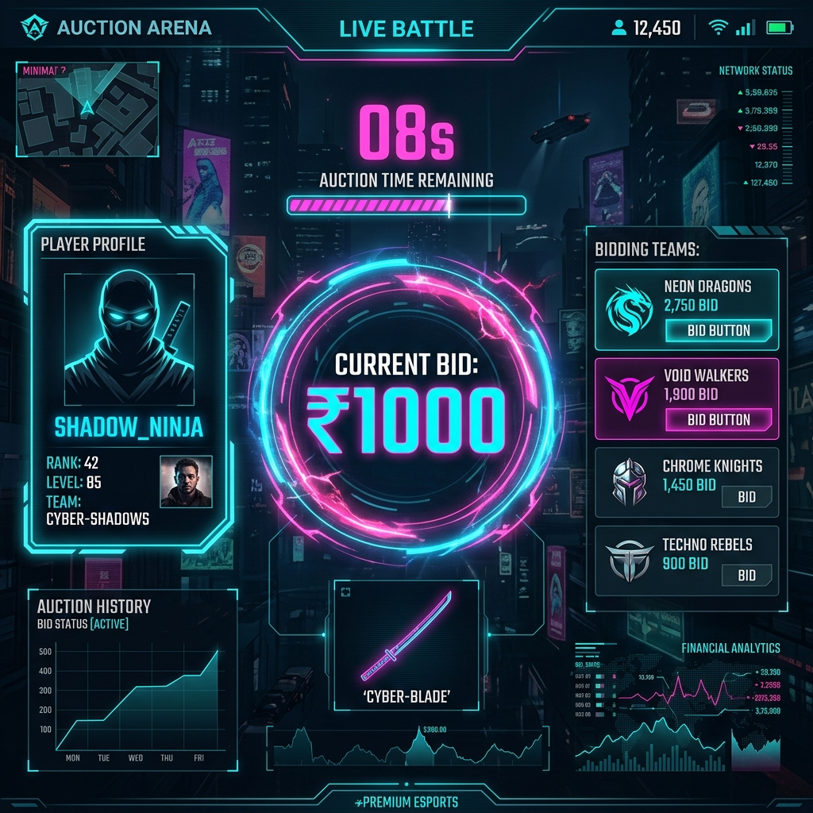
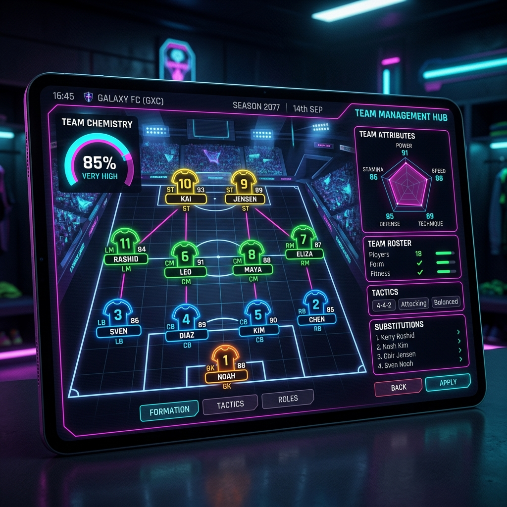
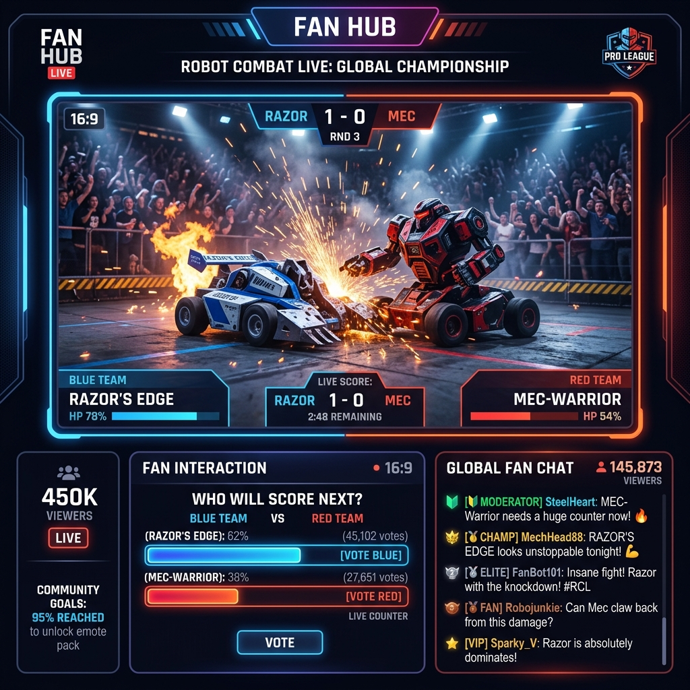

# 

# 🏆 KhelSync

[](https://nextjs.org/)
[](https://supabase.com/)
[](https://tailwindcss.com/)
[](https://opensource.org/licenses/MIT)

**KhelSync** is the ultimate real-time ecosystem designed for college tournaments, informal sports fests, and e-sports events. It bridges the gap between organizers, players, and spectators with a seamless, high-performance web interface.

---

## 🚀 Vision
In the fast-paced environment of college fests, managing fixtures, scores, and updates manually is a nightmare. **KhelSync** automates the chaos, providing real-time synchronization so everyone stays in the loop—from the first auction bid to the final trophy lift.

---

## ✨ Key Features

### 📡 Real-Time Ecosystem
- **Instant Notifications**: Stay updated with match starts, result submissions, and new announcements via Supabase Realtime.
- **Live Leaderboards**: Watch positions shift instantly as scores are reported.

### 📊 Professional Tournament Management
- **Automated Fixtures**: Generate clean, mathematically accurate single-elimination brackets with a single click.
- **Match Result Validation**: Organized workflow for reporting and verifying match outcomes.

### 💬 Integrated Networking
- **Global & Private Chat**: Coordinate with opponents or discuss strategies in tournament-specific chatrooms.
- **User Profiles**: Track personal win/loss stats and build a reputation in the community.

### 🎨 Premium User Experience
- **Adaptive Design**: Fully responsive UI built with Tailwind CSS and Shadcn/ui.
- **Dual-Mode**: Seamless switching between light and dark mode for optimal viewing in any environment.

---

## 📸 Visual Showcase

### 🖥️ Management Dashboard

*The central hub for tournament oversight, live streams, and real-time standings.*

### 🔨 Auction Arena

*Live player bidding with real-time state synchronization and dynamic price scaling.*

### 🏟️ Team Management Hub

*Tactical formation control, team chemistry analytics, and radar-based attribute tracking.*

### 📺 Fan Hub & Broadcast

*Interactive live streams with fan chat, prediction polls, and community goals.*

---

## 🛠️ Tech Stack

- **Frontend**: [Next.js](https://nextjs.org/) (App Router), [Tailwind CSS](https://tailwindcss.com/), [Shadcn/ui](https://ui.shadcn.com/), [Framer Motion](https://www.framer.com/motion/)
- **Backend**: [Supabase](https://supabase.com/) (Auth, PostgreSQL, Realtime, Storage)
- **Icons**: [Lucide React](https://lucide.dev/)
- **Deployment**: [Vercel](https://vercel.com/)

---

## 🏁 Quick Start

Follow these steps to get **KhelSync** running locally on your machine.

### 1. Prerequisites
- Node.js (v18+)
- A Supabase Project (Free tier works perfectly)

### 2. Installation
```bash
# Clone the repository
git clone https://github.com/Mukul7Raj/KhelSync.git

# Navigate to the project directory
cd KhelSync

# Install dependencies
npm install
```

### 3. Environment Setup
Create a `.env.local` file in the root directory and add your Supabase credentials:

```bash
NEXT_PUBLIC_SUPABASE_URL=your_supabase_project_url
NEXT_PUBLIC_SUPABASE_ANON_KEY=your_supabase_anon_key
```

### 4. Database Setup
To set up the necessary tables and relationships, copy the contents of `lib/fix_schema.sql` and run them in your **Supabase SQL Editor**. This will ensure all tables (`tournaments`, `tournamentUsers`, `notifications`, etc.) are correctly configured with the required columns and foreign keys.

### 5. Launch
```bash
npm run dev
```
Open [http://localhost:3000](http://localhost:3000) to view your local instance of KhelSync!

---

## 🤝 Contribution
Contributions are what make the open-source community such an amazing place to learn, inspire, and create. Any contributions you make are **greatly appreciated**.

1. Fork the Project
2. Create your Feature Branch (`git checkout -b feature/AmazingFeature`)
3. Commit your Changes (`git commit -m 'Add some AmazingFeature'`)
4. Push to the Branch (`git push origin feature/AmazingFeature`)
5. Open a Pull Request

---

## 📄 License
Distributed under the MIT License. See `LICENSE` for more information.

---

Built with ❤️ for **Hackathons**.